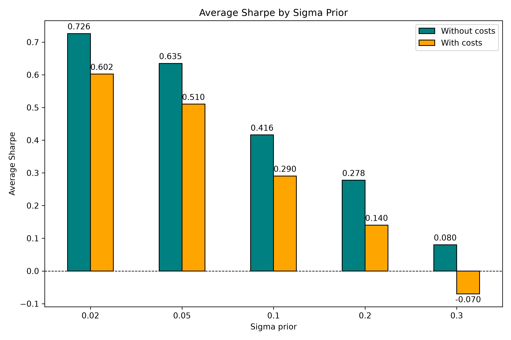
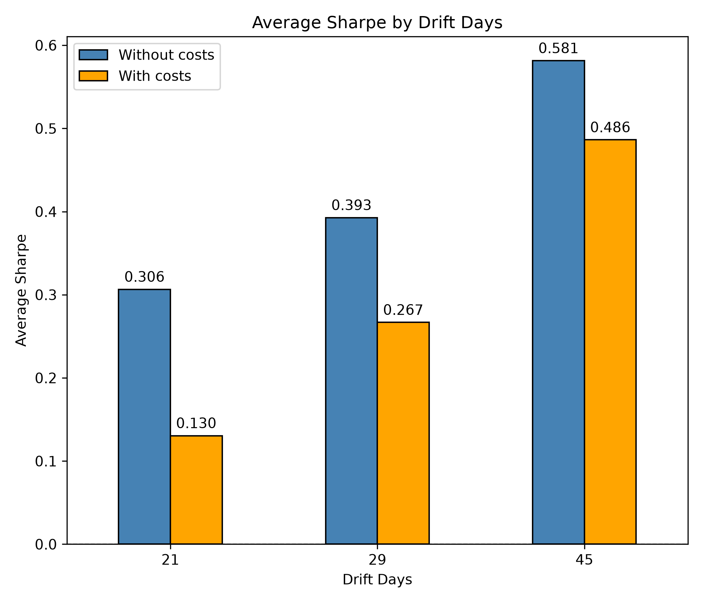
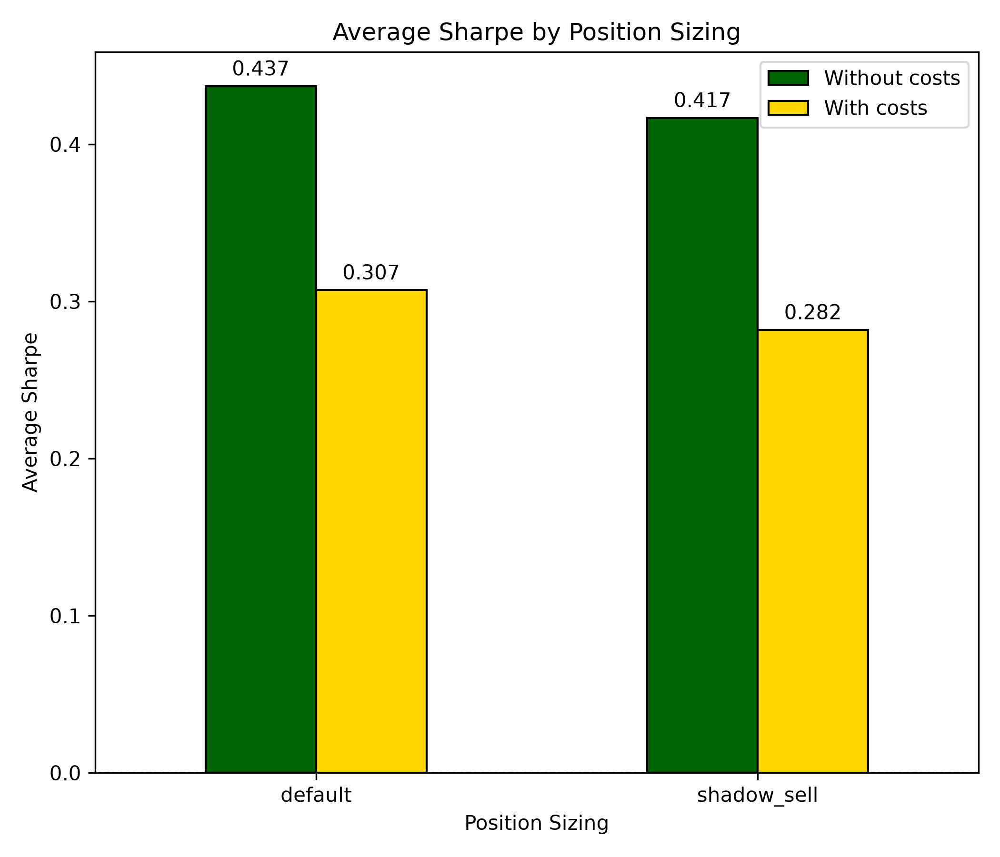
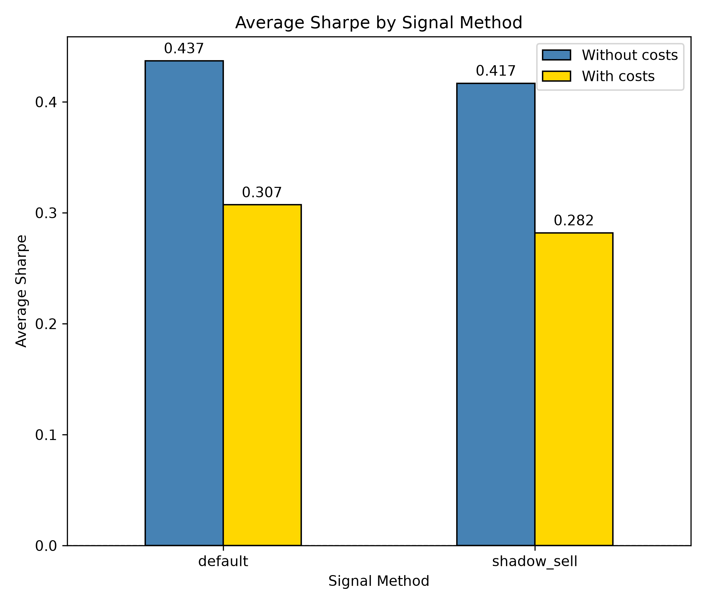
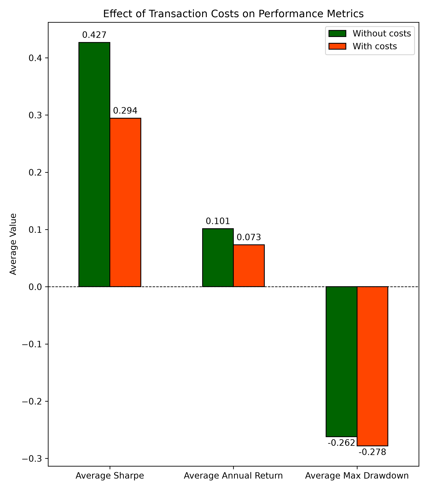
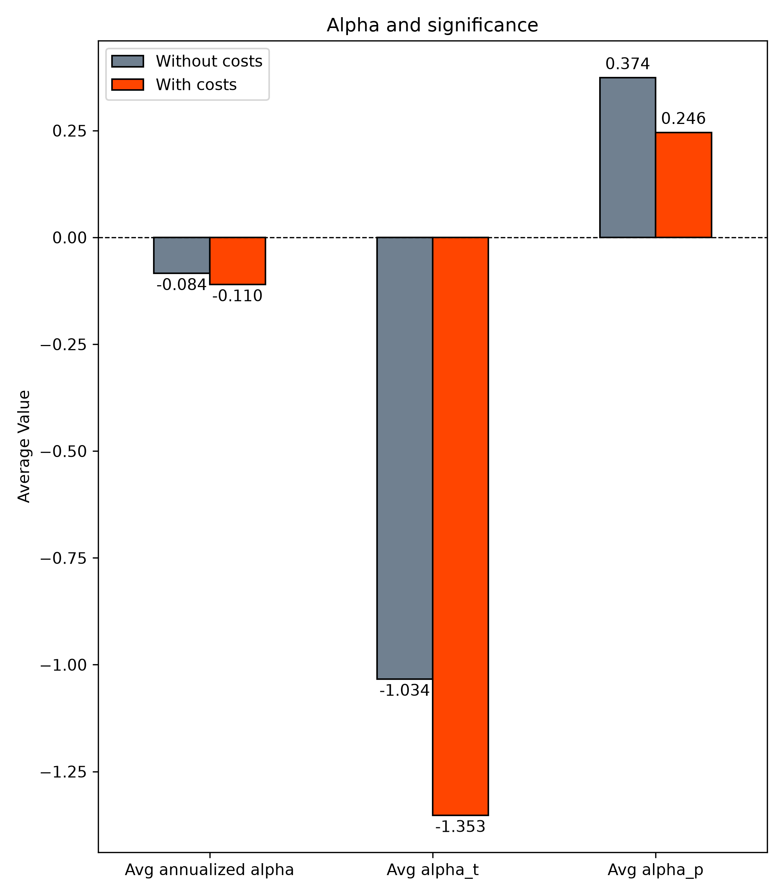

# Results: Analyst Recommendation Bayesian Strategy

The grid search evaluated 60 hyperparameter combinations of the strategy across the following parameters, with and without accounting for transaction costs.
- drift_days = 21, 29, 45
- sigma_prior = 0.02, 0.05, 0.1, 0.2, 0.3
- signal_method = default or shadow_sell
- position_sizing = equal or signal_weight

----

## Best performing configuration
The configuration with the highest Sharpe ratio used: 
- **default** signal method 
- **equal weighted** position sizing 
- **29 day** drift horizon 
- sigma prior: **σ = 0.02**

| Metric | Without transaction costs | With transaction costs |
| ------ | ------ | ------ |
| Sharpe | 0.871 | 0.747 |
| Annual return | 19.91% | 17.09% |
| Max Drawdown | -19.71% | -21.41% |

----

## Dominant Factors

### Shrinkage prior
**Shrinkage prior (σ)** drives the strategy performance.   
Sharpe ratio and shrinkage have strong negative correlation (-0.828). Smaller priors (more aggressive shrinkage to population mean) produced better risk-adjusted returns than larger priors that let low-confidence analyst estimates through.  
Sharpe fell steadily from 0.73 (σ = 0.02) to 0.08 (σ = 0.30) gross of transaction costs, and from 0.60 to ‑0.07 net of transaction costs. The loosest prior turned unprofitable once trading costs were applied.

This pattern is consistent with the strategy's core premise: "underestimated analysts" can only be reliably isolated when the ridge penalty is strong enough to suppress noise from small-sample analyst histories.

### Drift Horizon
Drift horizon matters, but less than shrinkage. Drift days and sharpe are moderately correlated (0.413).   
Average sharpe ratio rose with the length of the post-recommendation drift window tested, from 0.306 at 21 days to 0.581 at 45 days without transaction costs, and from 0.130 to 0.581 with transaction costs.  
Part of the reason is that longer windows retain more trades, so the gain could be due to a larger sample, instead of a better one. Drift days and number of trades are highly correlated (0.946).

### Others
- Position sizing and signal method make a very small difference to strategy performance, with default signal method and equal position sizing consistently performing better.
- Correlation with sharpe:
    * position sizing: 0.067
    * signal method: 0.036

----

## Transaction costs
A 10 bps round trip transaction costs significantly reduces the strategy edge. Transaction costs
- reduce average sharpe by 31.1%
- reduce average annualized return by 27.7%
- increase average max drawdown by 6.1%

----

## Market Exposure
- Across all 60 runs, estimated alpha is negative and statistically insignificant.
- In contrast, market beta is consistently large and highly significant (mean β ≈ 0.69, mean t-stat ≈ 28, all p ≈ 0).
- Also, t-stat of alpha has strong positive correlation (0.873) with sharpe ratio, indicating that the best-looking strategies by Sharpe are the ones where you're least able to reject the null hypothesis "true alpha is zero."

